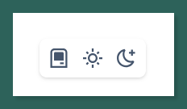
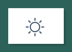

<div align="center">

<h1>Theme Switcher</h1>
</div>


<div>
<h2>About</h2>

<p>Theme switcher for React and TailwindCSS latest(React v19 and Tailwind v4)</p>



</div>


## Install

```bash
npm i lwe8-theme-switch
```

```bash
pnpm i lwe8-theme-switch
```

## Use

### 1. Theme Provider

`layout.tsx`

```ts
import { ThemeProvider } from "lwe8-theme-switch";

export default function RootLayout({
  children,
}: Readonly<{
  children: React.ReactNode;
}>) {
  return (
    <html lang="en">
      <body>
        <ThemeProvider>{children}</ThemeProvider>
      </body>
    </html>
  );
}
```

### 2. Dark mode selector in Tailwind v4.0

#### 2.1 Class

`globals.css`

```css
@import "tailwindcss";

@custom-variant dark (&:where(.dark, .dark *));
```

`dark` as class attribute

```html
<html class="dark">
  <body>
    <div class="bg-white dark:bg-black">
      <!-- ... -->
    </div>
  </body>
</html>
```

#### 2.2 Data Attribute

`globals.css`

```css
@import "tailwindcss";

@custom-variant dark (&:where([data-theme=dark], [data-theme=dark] *));
```

`dark` as data-theme attribute

```html
<html data-theme="dark">
  <body>
    <div class="bg-white dark:bg-black">
      <!-- ... -->
    </div>
  </body>
</html>
```

### 3. Using `<ThemeSwitch />`

```ts
import { ThemeSwitch } from "lwe8-theme-switch";
```

#### 3.1 Theme selector attributes

`types`

```ts
@default "data-theme"

attribute?: "class" | "data-theme";
```

**Depend on your config of tailwindCSS**

```tsx
<div>
  <ThemeSwitch attribute="class" />
</div>
```

### 3.2 Button Type

`types`

```ts
@default  "with-system"

btnType?: "light-icon" | "with-system";
```

```tsx
<div>
  <ThemeSwitch btnType="light-icon" />
</div>
```


